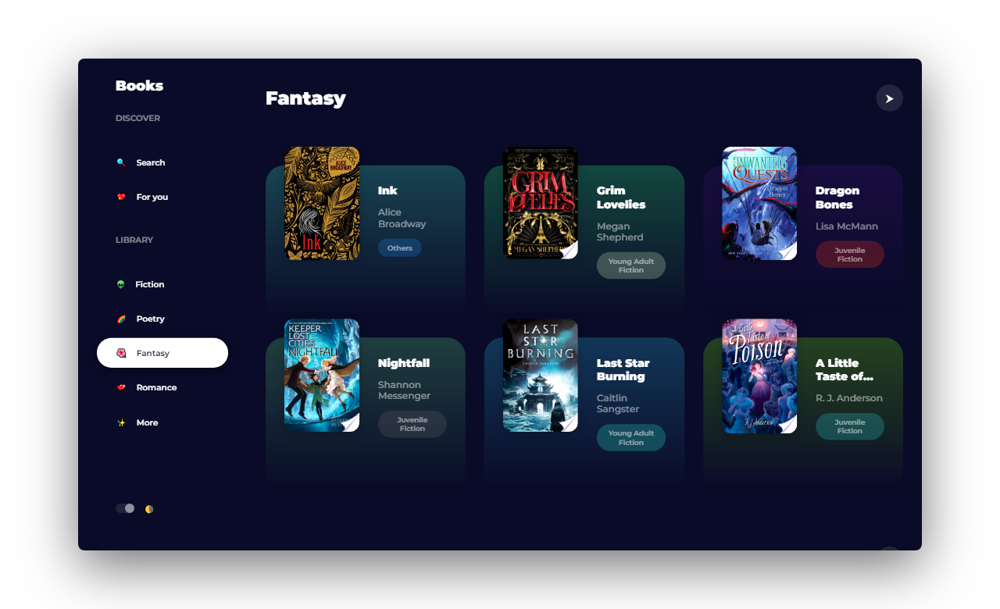

### 📚 Find books from Google Play Books 

   
  
  
   

### Features :sparkles:

:heart: **Lightweight and minimal**: Crafted with minimalistic UI design

:electric_plug: **Real-time search**: Search books by name, author, genre etc...

:zap: **Instant reading**: Click on any book to read it in Google Play Books!

:last_quarter_moon: **Turn off the lights!**: Dark mode to soothe your eyes

---

## Demo

* Search books by name, author, genre and etc...
* Collection of curated books just for you!
* Fiction, poetry, fantacy, romancs and many more!
* At night, turn off the lights!

---

* HTML - For the web framework
* CSS - For styling components
* JavaScript - For magic!

---

